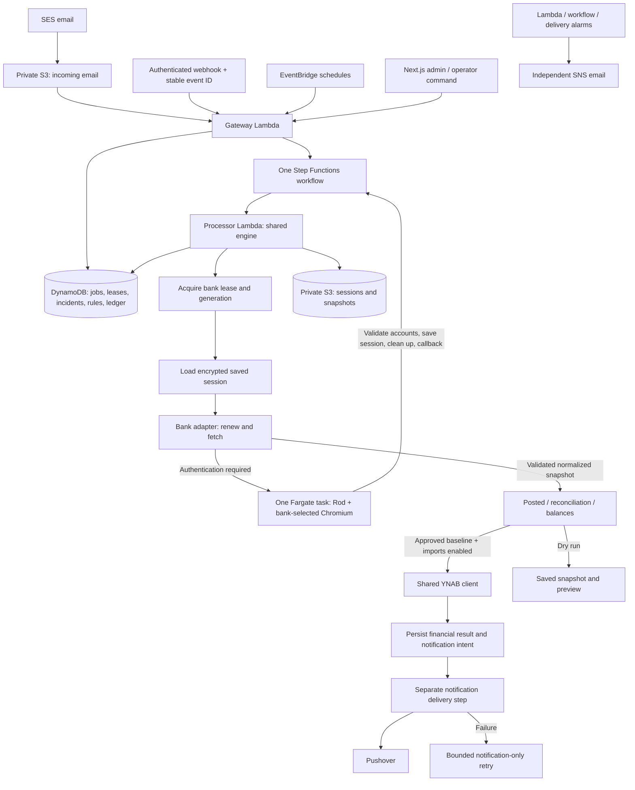

# Transactions

One Go application imports bank transactions and balances into YNAB. Bank protocols live in adapters; a shared engine owns authentication state, leases, reconciliation, writes and notification delivery. The Next.js admin is in `admin/` and calls the Go gateway through IAM-authenticated Lambda invocation.



## Repository

- `internal/bank`: adapter contract, typed failures, narrow HTTP/browser/MFA helpers.
- `internal/banks`: EQ, Rogers and NBDB adapters; registry owns schedules, browser selection and import strategy.
- `internal/engine`: one orchestration, retry, baseline, import and notification implementation.
- `internal/state`: one DynamoDB fencing and S3 persistence implementation.
- `internal/service`, `internal/override`, `internal/email`, `internal/notify`: reused YNAB, AI, JSONLogic, MIME and Pushover code.
- `cmd/lambda`: gateway and processor roles from the same Go binary.
- `cmd/browser`: bounded Rod authentication worker; no YNAB secret permission.
- `cmd/operator`: administrative API client; no session-reading operation.
- `cdk`: Go CDK definition for the complete runtime. No NAT gateway or always-running worker.
- `admin`: thin Next.js rule editor, job delivery status, authentication reset and baseline review.

## Operational rules

Authentication expiry permits renewal and one browser attempt per job. Credentials and unsupported challenges pause authentication until an operator resumes it. Maintenance, throttling and temporary read failures defer through the workflow. Arbitrary 403s and malformed bank responses are review failures, not a reason to log in repeatedly.

A bank lease fences every state change with a generation. Session objects are immutable; publishing their pointer requires the current lease. Browser results are saved before callbacks and recovered if the callback is lost. Browser work has an absolute deadline shorter than the callback timeout. EQ missing-activity waits release the lease for 1, 5 and 15 minutes.

EQ four-hour imports process cleared transactions only. Purchase-alert jobs retain the pending authorization import path.

EQ authentication runs on demand during four-hour imports and purchase-alert lookups. These jobs reuse usable sessions and renew or launch browser authentication when needed; sessions may expire between jobs, so purchase alerts can take longer to resolve. There is no background EQ upkeep schedule. Previously queued EQ upkeep jobs finish without authentication or bank requests. Explicit manual session verification remains available and has no import path. Rogers/NBDB authenticate when their scheduled retrieval needs it. Bank-enforced session limits still apply.

YNAB writes have no generic retry wrapper. Transaction creation uses stable import IDs; updates check the identified transaction after uncertain completion. An uncertain NBDB adjustment leaves an account hold that later jobs cannot bypass. Notifications have separate status and bounded delivery attempts; retrying delivery cannot import anything.

## Configuration and deployment

The one configuration document is `/transactions-engine/settings`. Application credentials and each bank's credentials use separate Secrets Manager resources. Do not put tokens in CDK context, workflow payloads, Git or logs. S3 objects are private and encrypted; browser IAM cannot read the application secret.

The committed CDK context records this production deployment with schedules active. For a fresh installation or a deliberate schedule pause, synthesize/deploy with `-c activate=false`; the initial settings placeholder always has imports disabled. Complete configuration and baseline review before enabling imports. Admin hosting is enabled with the `repository` and `githubTokenSecretArn` CDK contexts, using a Secrets Manager JSON `token` field.

The admin uses the official Auth0 Next.js SDK, following StarRez Entries, with one-day rolling sessions. `adminAuth0Domain`, `adminBaseUrl` and `adminAllowedEmails` configure the tenant, canonical URL and comma-separated verified-email allowlist. An empty allowlist denies access. Authentication is checked in middleware and again before every backend invocation; server actions preserve sign-in redirects when a session expires. There is no authentication bypass. The browser access-token endpoint is disabled.

`transactions-engine/admin-auth0` is a CDK-defined secret containing `clientId`, `clientSecret` and a generated, dedicated `sessionSecret`. Create a separate Auth0 Regular Web Application and populate the first two fields without replacing the generated session secret. Register `https://transactions-admin.fredericks.app/auth/callback` and `http://localhost:3000/auth/callback` as allowed callbacks, and both origins plus their `/sign-in` paths as allowed logout URLs. The Auth0 application must enable the intended identity connection. Auth0 credentials are referenced from Secrets Manager in the Amplify configuration; the hosting build writes only the required server environment variables to `.env.production`, without printing values. Rebuild the admin after credential changes.

**Auth0 cutover is pending tenant configuration and a real sign-in.** Keep the current hosting password gate until Auth0 credentials are populated and the authenticated build is deployed. Do not apply the final CDK hosting change (which removes basic authentication) to the old application build. After verifying the Auth0 redirect and login, deploy the final CDK template and remove the retained `transactions-engine/admin-password` secret. The old password gate is still active in production while this work is prepared.

The production admin is served at https://transactions-admin.fredericks.app/. The `adminDomain`, `adminSubdomain` and `adminCertificateArn` contexts define the Amplify domain mapping and existing ACM certificate in CDK. Cloudflare DNS is updated with the `cf` CLI to the CNAME target returned by Amplify; keep this record DNS-only. Runtime settings `adminUrl` must use the same HTTPS address for notification links. Set the `alarmEmail` context to the operator address and confirm the SNS subscription. Infrastructure email is independent of Pushover.

Use the [local verification loop](docs/local-verification.md) to fix authentication and exercise real API calls without redeploying.

See [cutover and verification](docs/cutover.md) and [adding a bank](docs/adding-a-bank.md). Do not enable production imports until the real-account verification and reviewed baseline gates have passed.

## Build and inspect

No mocks, new test files or test-suite runs are used for this rebuild. CI performs only static checks and builds.

```sh
GOWORK=off go build ./...
go vet ./...
(cd cdk && go build ./... && go vet ./...)
npm --prefix admin ci --ignore-scripts
npm --prefix admin run typecheck
npm --prefix admin run lint
npm --prefix admin run build
# If a local workspace does not exist: go work init . ./cdk
npx --yes aws-cdk@2.1144.0 synth --output dist/cdk
docker build --platform linux/arm64 -t transactions-engine-browser:verify .
```

Existing source-level tests in retained packages are historical, and are not the release evidence for this rebuild. The retired coordinator/handler implementations and their tests were removed with the old runtime.
